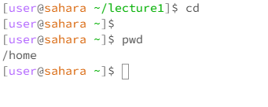
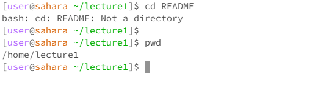
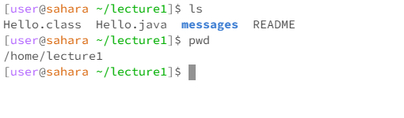
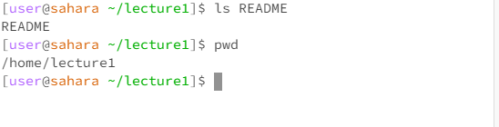

## Lab Report 1

**In each screenshot I used the pwd command to show the working directory but I will also add it below each image**

**`cd` with *no* arguments**

* When running the commad `cd` with no arguments, the working directory will change to `/home`. The output is not an error and it is a way to change the directory to `/home`. This output is not an error.

 **`cd` with a path to a *directory***

* When running the `cd` command with a path to a *directory*, the working directory is `lecture1`. The output is nothing but the working directory is changed from `/home` to `lecture1`, which alligns with the purpose of the cd command. The output is not an error.

**`cd` with a path to a *file***
 
  

  * When running the `cd` command with a path to a *file*, the working directory is still `lecture1`. This output occurs because a file is not a directory and thus does not work with the `cd` command. Since the file used is not considered a directory, there is an error thrown.
 
 
 **`ls` with *no* arguments**

 

* When running the `ls` command with no arguments, the working directory is `lecture1`. The output lists all of the files or directories in the lecture1 foler. The "messages" part of the output is blue and bold since it is a directory and not a file. This output is not an error.

**`ls` with a path to a *directory***

*When running the `ls` comamnd with the path as a directory, the working directory is `lecture1`. The output lists all the files in the messages/ directory without changing the working directory. There are four files that are a part of this output since there are four files in the messages/ directory. This is not an error.

**`ls` with a path to a *file***

