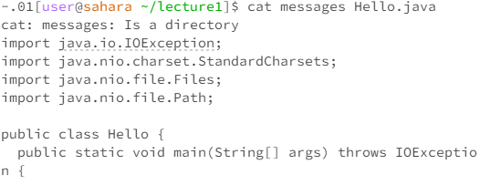
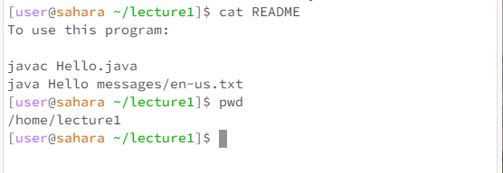
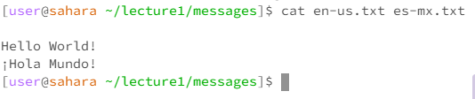

## Lab Report 1

**In each screenshot I used the pwd command to show the working directory but I will also add it below each image**

**`cd` with *no* arguments**

* When running the commad `cd` with no arguments, the working directory will change to `/home`. The output is not an error and it is a way to change the directory to `/home`. This output is not an error.

 **`cd` with a path to a *directory***

* When running the `cd` command with a path to a *directory*, the working directory is `lecture1`. The output is nothing but the working directory is changed from `/home` to `lecture1`, which alligns with the purpose of the `cd`\ command. The output is not an error.

**`cd` with a path to a *file***
 
  

  * When running the `cd` command with a path to a *file*, the working directory is still `lecture1`. This output occurs because a file is not a directory and thus does not work with the `cd` command. Since the file used is not considered a directory, there is an error thrown.
 
 
 **`ls` with *no* arguments**

 

* When running the `ls` command with no arguments, the working directory is `lecture1`. The output lists all of the files or directories in the lecture1 foler. The "messages" part of the output is blue and bold since it is a directory and not a file. This output is not an error.

**`ls` with a path to a *directory***

*When running the `ls` comamnd with the path as a directory, the working directory is `lecture1`. The output lists all the files in the messages/ directory without changing the working directory. There are four files that are a part of this output since there are four files in the messages/ directory. This is not an error.

**`ls` with a path to a *file***

* When running the `ls` command with the path as a file, the working directory is `lecture1`. The output is just the name of the file since the purpose of `ls` is to list all of the file names in the directory. If it is directed to a file it will simply print the name of the file. This is not an error.

**`cat` with *no* arguments**

* When running the `cat` command runs with no argument, the working directory is 'lecture1'. The output will actually be a place for the user to input the message that they want to concatinate. Since `cat` takes in two parameters, having no argument will mess up the function of the code. This is not an error since it is waiting for an input but it does not work as intended.

**`cat` with a *directory* path**

* When running the `cat` command runs with a path to a directory, the working directory is `lecture1`. The output states that the argument of messages is a directory. This is an error since it does not concatinate anything and restates the fact that the path that was chosen is a directory, and not a file like it expects. In the second image it is clear that the terminal will throw the error message and move onto the next file that was in the `cat` command.

  **`cat` with a path to a file**

* When running the `cat` command with a path to a file, the first image has a working directory of `lecture1` and the second image has a working directory of `messages`. Clearly, when using the `cat` command with a path to a file, it will either print the file if it is only given one argument, or it will print both of the files given if given more than one argument. Either way, the output is the files that are given in the command line. This is not an error.
