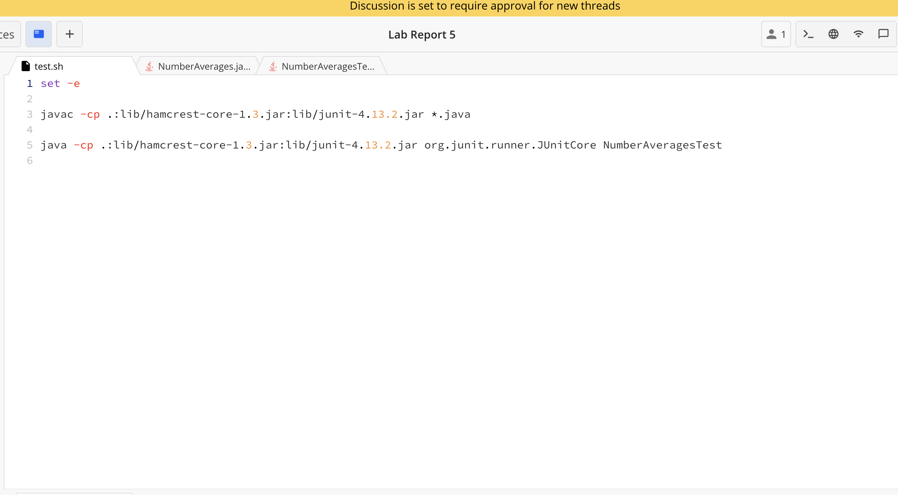

## Lab Report 2

**Code for ChatServer.Java** 
```
import java.io.IOException;
import java.net.URI;
import java.io.*;
import java.util.*;

class Handler implements URLHandler {
    ArrayList<String> messages = new ArrayList<>();
    
    public String handleRequest(URI url) {
        if (url.getPath().equals("/")) {
            return "Please enter a message in the search bar";
        } else if (url.getPath().equals("/add-message")) {

            String[] parameters = url.getQuery().split("&");

            String user = null;
            String message = null;

            for (String pair : parameters) {
                String[] values = pair.split("=");
                if (values.length == 2) {
                    String key = values[0];
                    String value = values[1];

                    if ("s".equals(key)) {
                        message = value;
                    } else if ("user".equals(key)) {
                        user = value;
                    }
                }
               
            }

             if (message != null && user != null) {
                String finalMessage = user + ": " + message;
                messages.add(finalMessage);
                return String.format("%s",String.join("\n", messages));
        
            } else {
                return "Invalid parameters!";
            }
        }

        return "404 Not Found!";
    }
}

class ChatServer {
    public static void main(String[] args) throws IOException {
        if (args.length == 0) {
            System.out.println("Missing port number! Try any number between 1024 to 49151");
            return;
        }

        int port = Integer.parseInt(args[0]);

        Server.start(port, new Handler());
    }
}
```

**Screenshots of `/add-message` in action!**


The methods that are called in my code are 
* The `main` method
* The `handleRequest` method

The relevant arguments for this screenshot are the `args` and the `url` arguments that are passed through the `main` and `handleRequest` methods respectively. 

The values that are in relevant fields are the values of the messages ArrayList, which is updated every time there is a message added and returned each time as well. For this screenshot specifically, the relevant value is the `Hello` and the `jpolitz`in 
`/add-message?s=Hello&user=jpolitz`

The values of the ArrayList messages change from this specific request.


The relevant arguments for this screenshot are the `args` and the `url` arguments that are passed through the main and handleRequest methods respectively. 

The values that are in relevant fields are the values of the messages ArrayList, which is updated every time there is a message added and returned each time as well. For this screenshot specifically, the relevant value is the `Hello there!` and the `Allyson Ybarra` in `/add-message?s=Hello there!&user=Allyson Ybarra`

The values of the ArrayList messages change from this specific request.


**Part 2**





**Part 3**

I learned many new commands such as `mkdir`, `ssh-keygen`, `scp`. I also learned more about how URLs and web servers work and how to program very basic web servers. I did not know that you could just create a website on edstem for free so that was pretty cool to find out. I can imagine all of the possibilities with that. In turn, I learned how to update the servers and make programs that update the values on a server.
