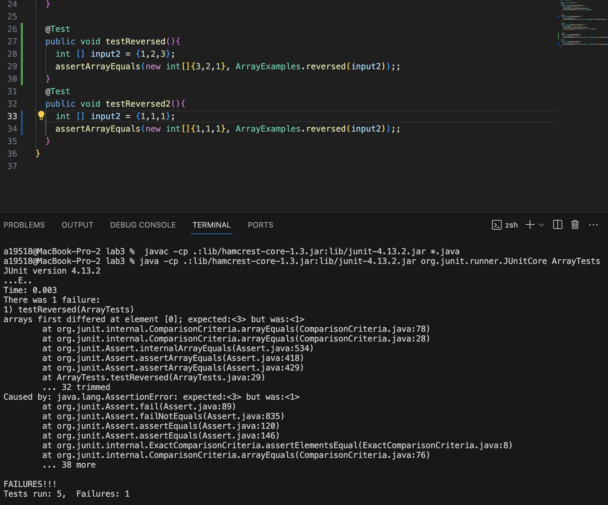

# Lab Report 3

## Part 1

The bug I am choosing for this part of the lab report comes from the bug in ArrayExample.java's `reversed` method:

```
static int[] reversed(int[] arr) {
    int[] newArray = new int[arr.length];
    for(int i = 0; i < arr.length; i += 1) {
      arr[i] = newArray[arr.length - i - 1];
    }
    return arr;
  }
```

**A failure-inducing input**

```
@Test
  public void testReversed(){
    int [] input2 = {1,2,3};
    assertArrayEquals(new int[]{3,2,1}, ArrayExamples.reversed(input2));;
  }
```

**An input that doesn't induce a failure**

```
@Test
  public void testReversed2(){
    int [] input2 = {1,1,1};
    assertArrayEquals(new int[]{1,1,1}, ArrayExamples.reversed(input2));;
  }
```

**The symptom (the output of running the tests)**




**The bug before and after**

Before: 

```
static int[] reversed(int[] arr) {
    int[] newArray = new int[arr.length];
    for(int i = 0; i < arr.length; i += 1) {
      arr[i] = newArray[arr.length - i - 1]; //This is a bug
    }
    return arr; //This is a bug
  }
```

After: 

```
static int[] reversed(int[] arr) {
    int[] newArray = new int[arr.length];
    for (int i = 0; i < arr.length; i += 1) {
        newArray[i] = arr[arr.length - i - 1]; // This is a fix
    }
    return newArray; //This is a fix
}
```

The fix addresses the issue since the original code did not return the newArray which is where the reversal happened. Also, the assignment of the reversed array should be from `arr` and not the other way around. Overall, there were two bugs in the original code, but both were fixed in the second block of code and the test cases passed. 


## Part 2

The command I will be researching is the `find` command.

1. You can use the `find` command to locate files by age/since modified using the `-mtime` command-line option.

*Example 1*

```
a19518@MacBook-Pro-2 technical % find /var/log -iname "*~" -o -iname "*log*" -mtime 7
/var/log/wifi.log.7.bz2
```
This command is finding the files that have been modified in the past week.

*Example 2*

```
a19518@MacBook-Pro-2 technical % find /var/log -iname "*~" -o -iname "*log*" -mtime 2   
/var/log/system.log.2.gz
/var/log/wifi.log.2.bz2
/var/log/fsck_apfs.log
```
This command is finding the files that have been modified in the past 2 days.

This command was found at https://www.redhat.com/sysadmin/linux-find-command.


2. You can use the `find` command to list just the directories with `-type d`

*Example 1*

```
a19518@MacBook-Pro-2 ~ % find ~/Docsearch/technical -type d
/Users/a19518/Docsearch/technical
/Users/a19518/Docsearch/technical/government
/Users/a19518/Docsearch/technical/government/About_LSC
/Users/a19518/Docsearch/technical/government/Env_Prot_Agen
/Users/a19518/Docsearch/technical/government/Alcohol_Problems
/Users/a19518/Docsearch/technical/government/Gen_Account_Office
/Users/a19518/Docsearch/technical/government/Post_Rate_Comm
/Users/a19518/Docsearch/technical/government/Media
/Users/a19518/Docsearch/technical/plos
/Users/a19518/Docsearch/technical/biomed
/Users/a19518/Docsearch/technical/911report
```

These are all the sub-directories in the `./technical` directory.

*Example 2*

```
a19518@MacBook-Pro-2 ~ % find ~/Docsearch/technical/government -type d 
/Users/a19518/Docsearch/technical/government
/Users/a19518/Docsearch/technical/government/About_LSC
/Users/a19518/Docsearch/technical/government/Env_Prot_Agen
/Users/a19518/Docsearch/technical/government/Alcohol_Problems
/Users/a19518/Docsearch/technical/government/Gen_Account_Office
/Users/a19518/Docsearch/technical/government/Post_Rate_Comm
/Users/a19518/Docsearch/technical/government/Media
```

These are all of the directories within the `government` directory in `./technical`.

This command was found at https://www.redhat.com/sysadmin/linux-find-command.


3. You can use the `find` command to locate a limited amount of results

*Example 1*

```
a19518@MacBook-Pro-2 ~ % find ~/Docsearch/technical -maxdepth 2 -type d
/Users/a19518/Docsearch/technical
/Users/a19518/Docsearch/technical/government
/Users/a19518/Docsearch/technical/government/About_LSC
/Users/a19518/Docsearch/technical/government/Env_Prot_Agen
/Users/a19518/Docsearch/technical/government/Alcohol_Problems
/Users/a19518/Docsearch/technical/government/Gen_Account_Office
/Users/a19518/Docsearch/technical/government/Post_Rate_Comm
/Users/a19518/Docsearch/technical/government/Media
/Users/a19518/Docsearch/technical/plos
/Users/a19518/Docsearch/technical/biomed
/Users/a19518/Docsearch/technical/911report
```
This is the output of the `find` and `-type d` command being limited to a `maxdepth` of 2. The command `-maxdepth 2` makes it so the `find` command will not go into sub-directories *past* the 2nd sub-directory.

*Example 2*

```
a19518@MacBook-Pro-2 ~ % find ~/Docsearch/technical -maxdepth 1 -type d
/Users/a19518/Docsearch/technical
/Users/a19518/Docsearch/technical/government
/Users/a19518/Docsearch/technical/plos
/Users/a19518/Docsearch/technical/biomed
/Users/a19518/Docsearch/technical/911report
```
This is the output of the `find` and `-type d` command being limited to a `maxdepth` of 1. The command `-maxdepth 1` makes it so the `find` command will not go into sub-directories.

This command was found at https://www.redhat.com/sysadmin/linux-find-command.


4. `find` can be used with `-L` and it will list all files in the directory.

*Example 1*

```
a19518@MacBook-Pro-2 ~ % find -L docsearch/technical/911report 
docsearch/technical/911report
docsearch/technical/911report/chapter-13.4.txt
docsearch/technical/911report/chapter-13.5.txt
docsearch/technical/911report/chapter-13.1.txt
docsearch/technical/911report/chapter-13.2.txt
docsearch/technical/911report/chapter-13.3.txt
docsearch/technical/911report/chapter-3.txt
docsearch/technical/911report/chapter-2.txt
docsearch/technical/911report/chapter-1.txt
docsearch/technical/911report/chapter-5.txt
docsearch/technical/911report/chapter-6.txt
docsearch/technical/911report/chapter-7.txt
docsearch/technical/911report/chapter-9.txt
docsearch/technical/911report/chapter-8.txt
docsearch/technical/911report/preface.txt
docsearch/technical/911report/chapter-12.txt
docsearch/technical/911report/chapter-10.txt
docsearch/technical/911report/chapter-11.txt
```
This is all of the .txt files within `911report` directory.  The `find -L` command is iterating through the directory and printing the files it finds.

*Example 2*

```
a19518@MacBook-Pro-2 ~ % find -L docsearch/technical/government/About_LSC 
docsearch/technical/government/About_LSC
docsearch/technical/government/About_LSC/LegalServCorp_v_VelazquezSyllabus.txt
docsearch/technical/government/About_LSC/Progress_report.txt
docsearch/technical/government/About_LSC/Strategic_report.txt
docsearch/technical/government/About_LSC/Comments_on_semiannual.txt
docsearch/technical/government/About_LSC/Special_report_to_congress.txt
docsearch/technical/government/About_LSC/CONFIG_STANDARDS.txt
docsearch/technical/government/About_LSC/commission_report.txt
docsearch/technical/government/About_LSC/LegalServCorp_v_VelazquezDissent.txt
docsearch/technical/government/About_LSC/ONTARIO_LEGAL_AID_SERIES.txt
docsearch/technical/government/About_LSC/LegalServCorp_v_VelazquezOpinion.txt
docsearch/technical/government/About_LSC/diversity_priorities.txt
docsearch/technical/government/About_LSC/reporting_system.txt
docsearch/technical/government/About_LSC/State_Planning_Report.txt
docsearch/technical/government/About_LSC/Protocol_Regarding_Access.txt
docsearch/technical/government/About_LSC/ODonnell_et_al_v_LSCdecision.txt
docsearch/technical/government/About_LSC/conference_highlights.txt
docsearch/technical/government/About_LSC/State_Planning_Special_Report.txt
```
This is all of the files in the `/About_LSC` directory. The `find -L` command is iterating through the directory and printing the files it finds.

This command was found on https://man7.org/linux/man-pages/man1/find.1.html.
