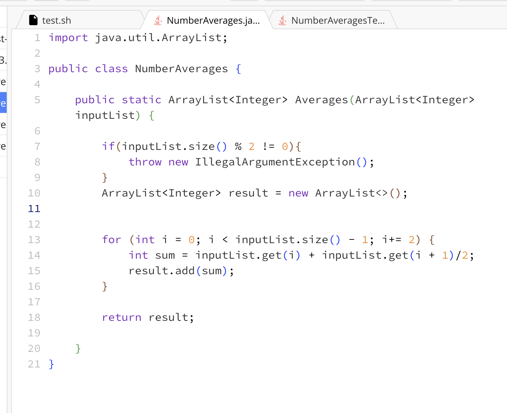
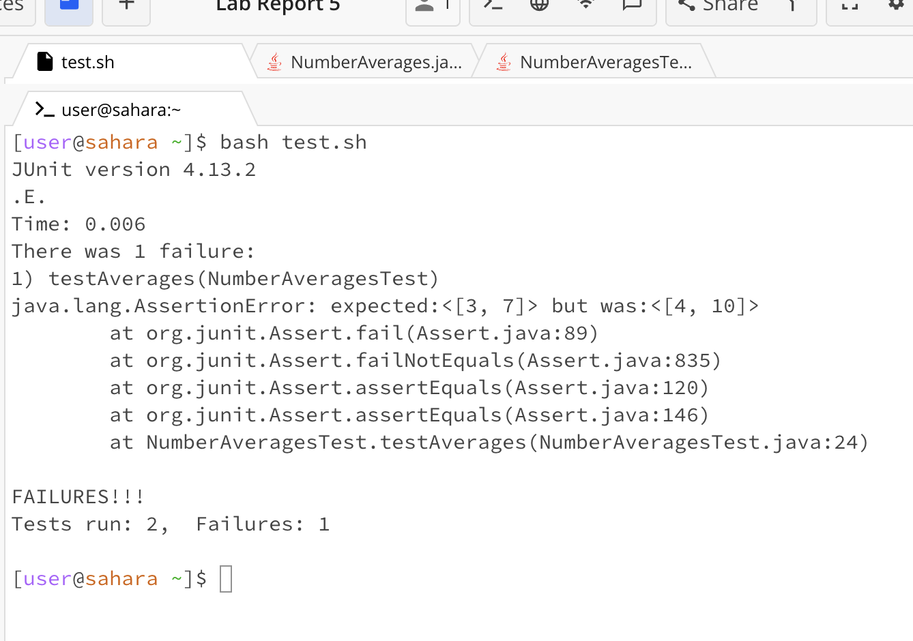
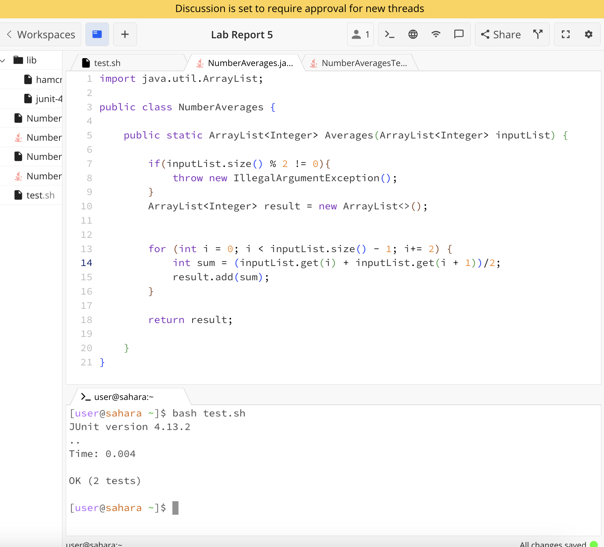
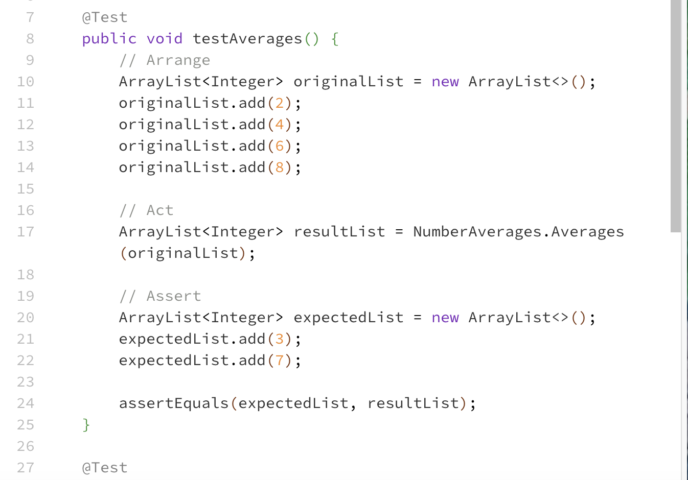

# Lab Report 4

**1. Log into ieng6** 

I wrote `ssh agybarra@ieng6` then `<enter>` to log into the ieng6.

**2. Clone your fork of the repository from your Github account (using the SSH URL)**

First I forked the repository on github. I then copied the SSH URL and typed 
`git clone git@github.com:agybarra/lab7.git` then I hit `<enter>` which would clone the repository and allow me to edit the files using vim in the terminal.

**3. Run the tests, demonstrating that they fail**

First I typed `cd` and `lab7` into the terminal and then hit `<enter>` to get into the lab7 directory.

Then I typed `bash test.sh` and hit `<enter>` to run the tests.

**4. Edit the code file to fix the failing test**

First I typed `vim` `<space>` `L` `<tab>` `.java` to get the command `vim ListExamples.java` and then I hit `<enter>` to enter the file through vim so I could edit in the terminal.

Since the cursor when I entered vim was at the beginning of the file, I hit the `<down>` arrow key 44 times to get to the correct line in the file and I hit `<right>` 13 times to get to the space after `index1`. After that, I hit `<i>` to go into insert mode. I then hit `<delete>` to delete the 1 and then I hit `<2>` to replace the 1 with a 2. After that, I hit `<ESC>` to leave insert mode and finally typed `:wq` and `<enter>` to leave and save vim.

**5. Run the tests, demonstrating that they now succeed** 

The command `bash test.sh` was in my bash history so I hit `<up> <up>` and then `<enter>` to run the test file again.

**6. Commit and push the resulting change to your Github account (you can pick any commit message!)**

First, I typed `git add List<tab>.java` into the terminal to get `git add ListExamples.java` which adds the changed files to the staging area from the working directory.

Then, I typed `git commit -m "edited file"` to commit the changes with the message "edited file" to git.

Finally, I typed `git push` to finish committing the changes.

