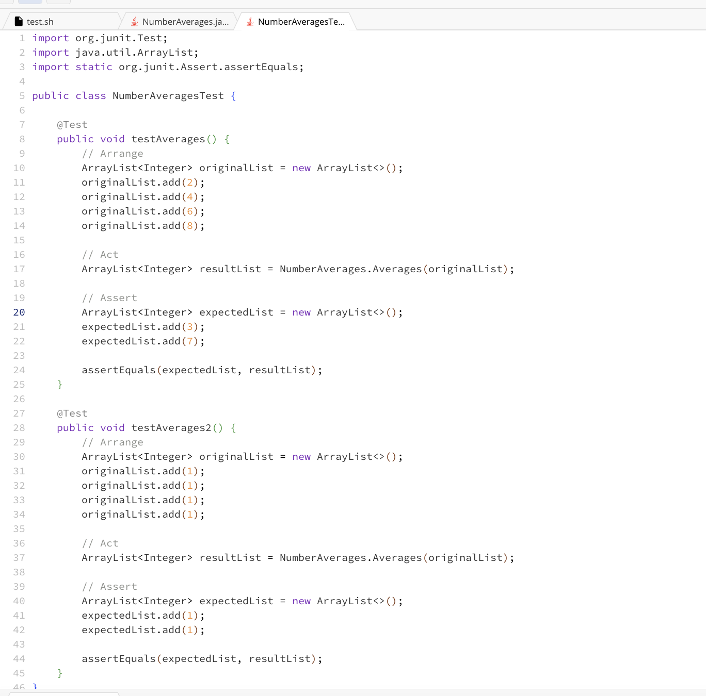
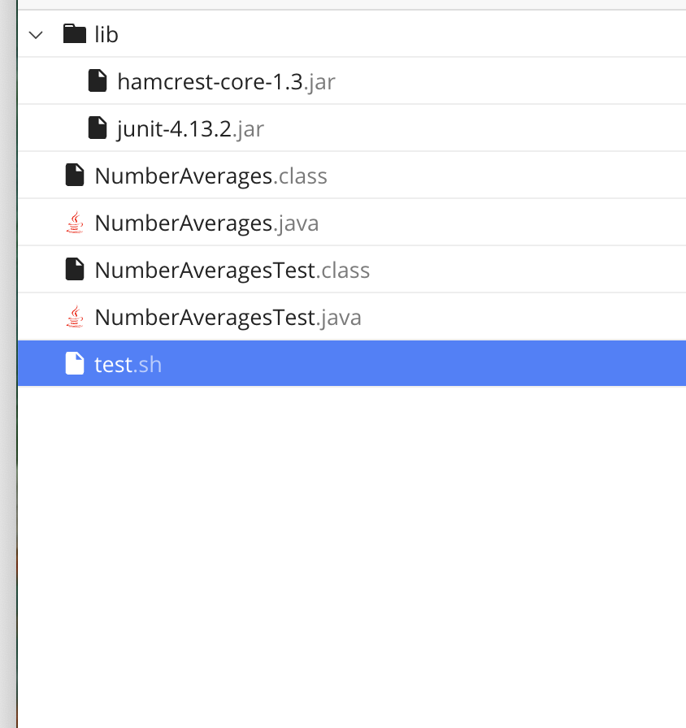
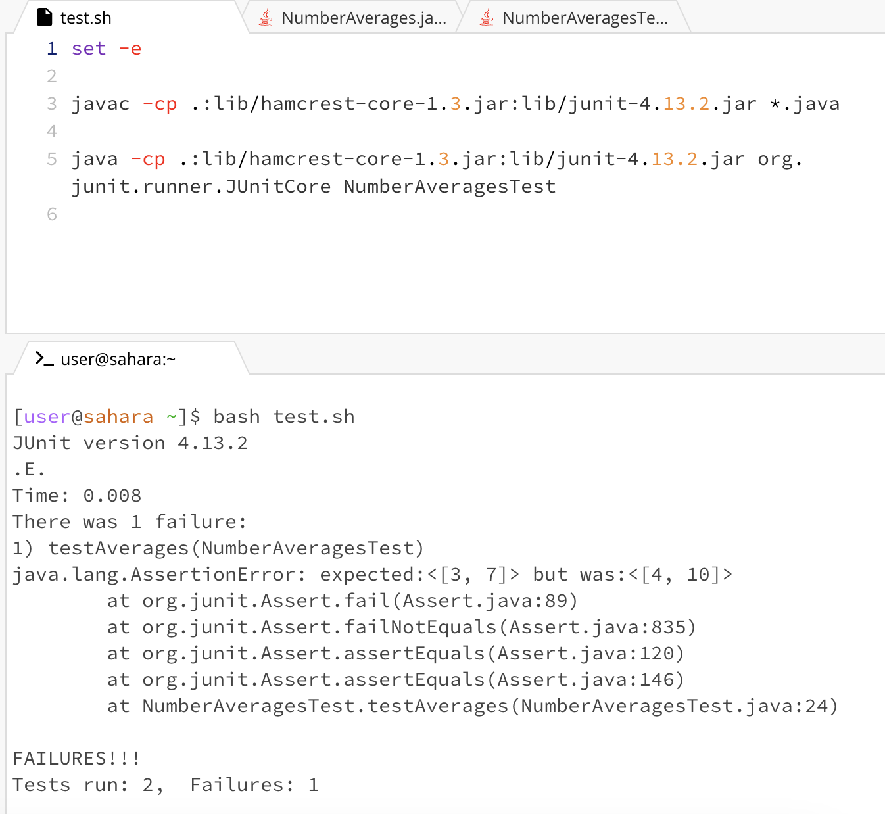

# Lab Report 5

## Part 1

**Original Post**

**Student123:**
Hello! I am having a problem with the method I am creating, it is supposed to return an array list where the elements are the average of the two numbers that are next to each other in an even-sized ArrayList.

For example, an ArrayList [2,4,6,8,] should return [3,7]

Here are screenshots of my code:

Here is a screenshot of my failure-inducing input:

As you can see, the symptom is that the output of my code is not the expected values. I believe that the code is not calculating the averages correctly.

**TA Response**

Hi, I would suggest that you review what values the code you wrote is adding and dividing and try to remember what the order of operations is on calculations in java as there seems to be an error in the calculation of the sum variable. 

Hope this helps!

**Follow-up Response**

Thank you for your help! I see now that the bug is the `/2` in the calculation of the sum `int sum = inputList.get(i) + inputList.get(i + 1)/2;`. I see now that the operation should be 
`int sum = (inputList.get(i) + inputList.get(i + 1))/2;` with parenthesis around the sum numerator. 

The bug was that the method was only dividing the integer after `i` by two (`i+1`), and not the sum of the integer at `i` and `i+1`

The method follows the expected behavior after changing this.

**Information about the setup**

1. Directory setup :
   

2. The contents of each file before fixing the bug is above under the Original Post
3. The full command line I ran to trigger the bug:
   
4. To fix the bug, put a set of parenthesis around `inputList.get(i) + inputList.get(i + 1)` to properly set up the numerator for the average calculation.

   
## Part 2

I learned about Vim and that you can edit a file through the terminal which seems like a very useful tool when trying to debug. It was a little hard to get the hang of but I did enjoy learning about vim and all you can do with it. I felt that being able to ask the TAs in the lab about Vim was also helpful since I was able to hear about the different experiences in using Vim.
